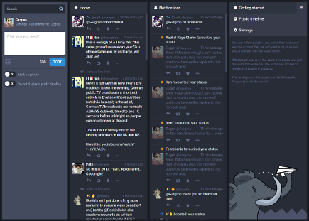

# Mastodon
_A GNU Social-compatible microblogging server_

https://mastodon.social/

Mastodon is a free, open-source social network server. A decentralized solution to commercial platforms,
it avoids the risks of a single company monopolizing your communication.
Anyone can run Mastodon and participate in the social network seamlessly.

Administrator email: mastodon@localhost, password: password. Please change them as soon as you login.
To access administrative settings, go to /admin on your instance.
You will also be able to register your personal public account.

